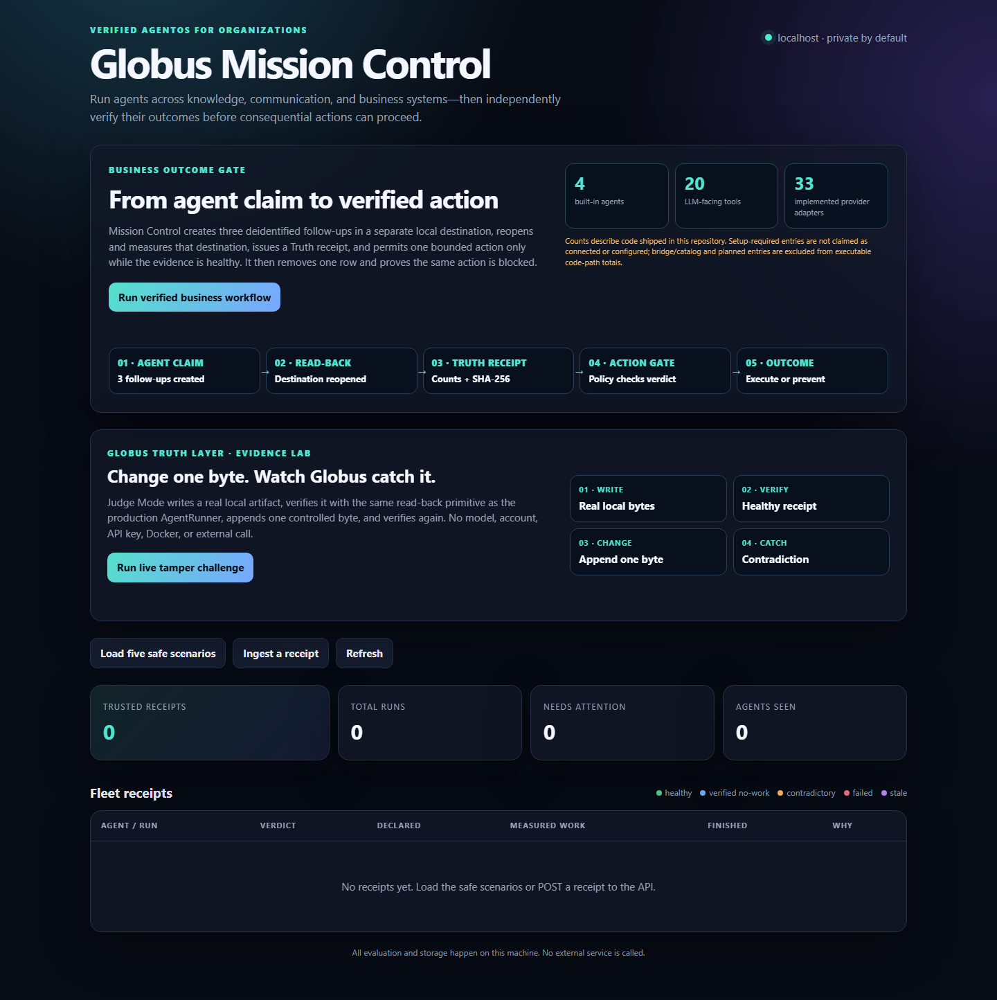
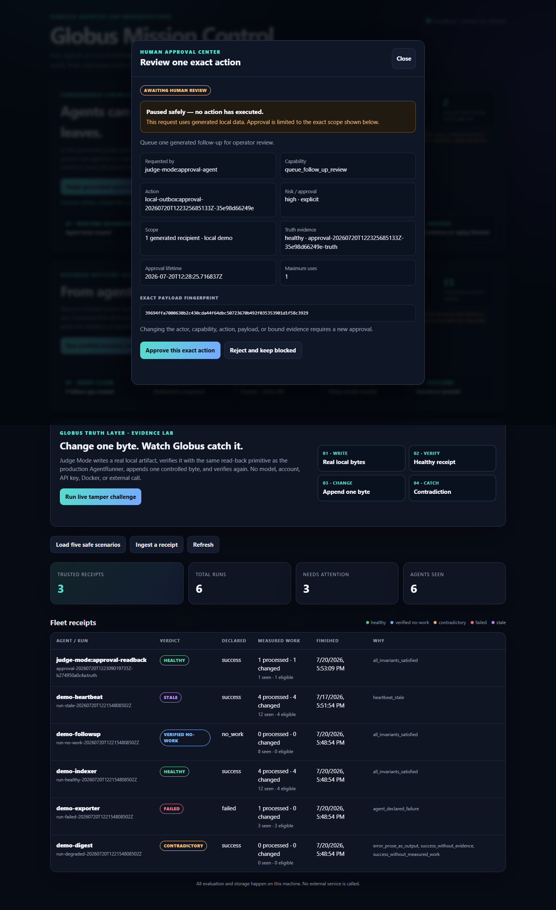
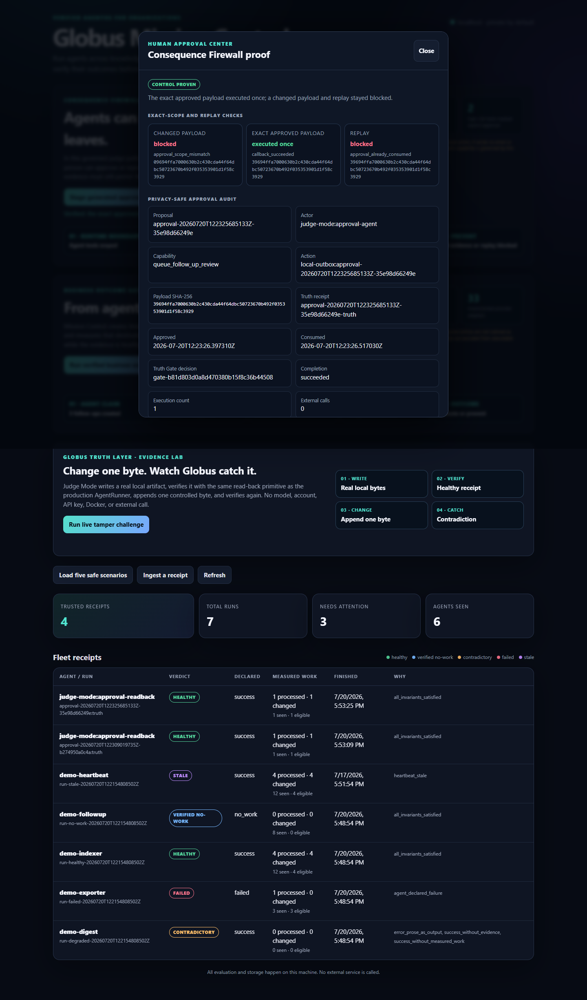
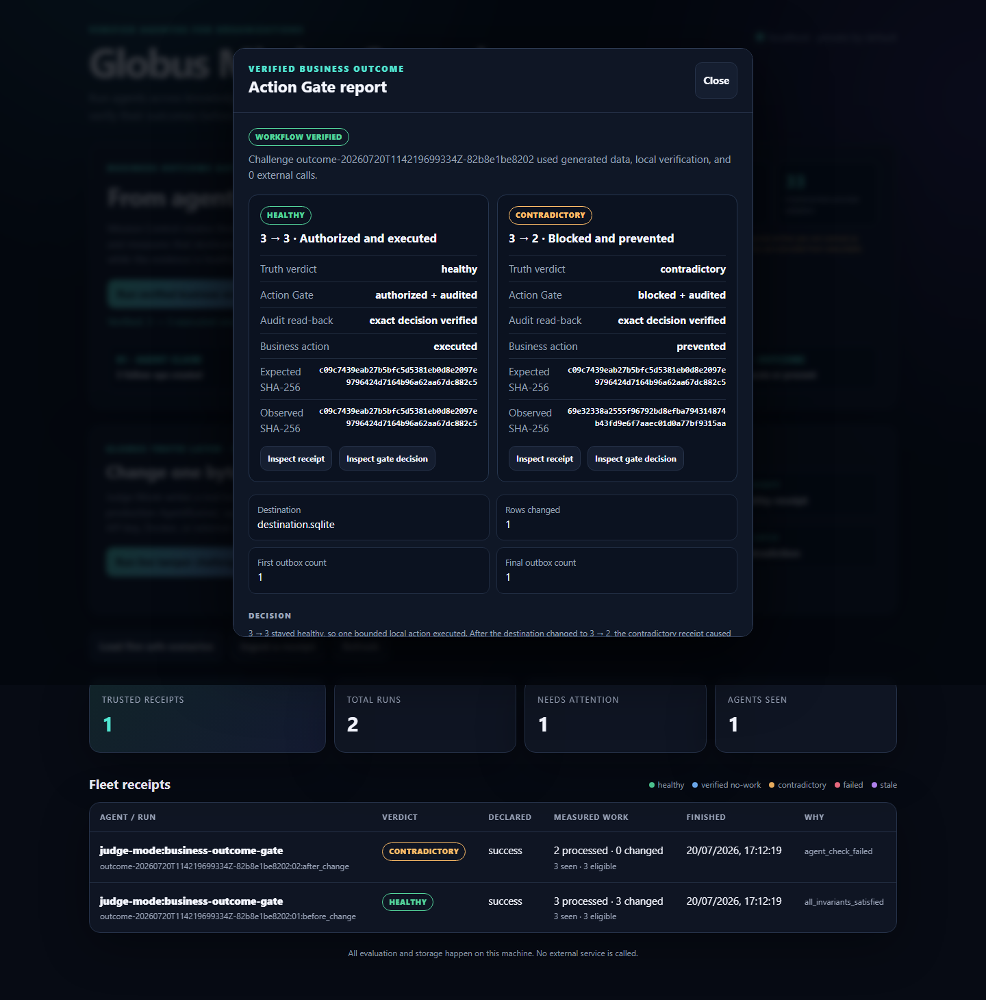
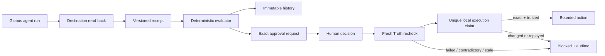

# Globus

**Your private AI assistant that knows everything happening across your
business — every email, every CRM record, every WhatsApp and Telegram
message, every Google Drive doc, every customer conversation.**

Text chat + JARVIS-style voice. Cites every claim. Per-member-private:
nobody can read anyone else's data. Self-hosted on your own server.

Open source under [AGPL-3.0](LICENSE). The managed version lives inside
[The Automation Founders community at buildwithsumit.com](https://buildwithsumit.com/community.html).

> ⚠️ **Alpha — opinionated reference implementation.** Globus is the
> exact code running production at buildwithsumit.com. It's not yet a
> turn-key SaaS-in-a-box; expect to read the source, edit the persona,
> and wire up the integrations you care about. See [INSTALL.md](INSTALL.md)
> for the realistic install path and [ARCHITECTURE.md](ARCHITECTURE.md)
> for the module map.

## What it does

You give it:
- **Your data sources** (any subset, all optional): Google Drive,
  Gmail, Microsoft Teams and WhatsApp Web (via a Chrome extension),
  Telegram (via Telethon), Freshsales CRM, Google
  Analytics, Obsidian zip uploads, raw markdown paste.
- **Your members** (the people who get an account on your install).

It runs three surfaces:

1. **Members text chat** — `/members/globus`. The member asks anything
   ("what should I respond to today?", "where are we on the Acme
   deal?", "what did the team decide about Q3 hiring?"). Globus calls
   tools (`search_files`, `read_file`, `search_content`,
   `list_recent_emails`, `search_whatsapp`, `search_telegram`) over
   the member's vault and answers with citations.
2. **Members voice** — same page, JARVIS-style orb. Hands-free voice
   conversation via ElevenLabs. Same brain, same tools, same data —
   just out loud. Vault-aware.
3. **Public preview** — `/globus`. An opt-in text preview using the
   configured LLM. It has no vault or tool access and is guarded by
   per-IP and install-wide daily caps.

Plus a **background agent fleet** (`/members/globus/agents`) that runs
on schedules and produces briefs you read at 8 AM. Each agent
declares what data it reads + what it can and cannot do; nothing acts
without your sign-off.

## OpenAI Build Week: Globus Mission Control



[`globus_truth/`](globus_truth/) is a self-contained reliability and control
layer for the agent fleet. v0.14 adds a **Consequence Firewall** to Mission
Control: four built-in background agents now receive exact, deny-by-default
tool grants. The orchestrator shows each agent only its granted tool schemas
and rechecks every requested tool at dispatch, so a forged tool name cannot
reach the dispatcher. These grants cover the four shipped agents, not every
capability in the platform inventory.

The versioned v1 receipt contract supplies the foundation. Agents emit measured
counts, timestamps, checks, heartbeats, and evidence references. A deterministic
evaluator returns one of five explainable verdicts: healthy, verified no-work,
contradictory, failed, or stale. Receipts, verdict history, and immutable action
decisions stay in local SQLite.

The new Approval Center pauses an exact high-risk proposal for a person to
approve or reject. It stores IDs, policy metadata, timestamps, and SHA-256
bindings—not the action payload. Human consent is necessary but never enough:
execution still requires a fresh Truth verdict, an exact proposal hash, and a
unique execution claim immediately before the bounded callback.

Run the complete de-identified demo with no setup beyond Python 3.10+:

```bash
python -m globus_truth
```

Open <http://127.0.0.1:8765>. The component has no third-party dependencies and
does not call an external service. Its [README](globus_truth/README.md)
documents the receipt contract, Consequence Firewall, Approval Center, Action
Gate policies, API, CLI, integration path, supported platforms, limitations,
and test command.

For the fastest v0.14 judge path, click **Stage generated approval request**.
The credential-free demo stages one generated high-risk local action and proves
that nothing executes before the click. After approval it first tries a changed
payload, which is blocked; then it executes the exact payload once after a
fresh Truth check; finally it replays the exact request, which is blocked by the
already-consumed claim. The independent local outbox ends with exactly one row.
No action payload is stored in the Approval Center.

<p align="center">
  <a href="docs/assets/globus-consequence-firewall-pending.png"></a>
  <a href="docs/assets/globus-consequence-firewall-proof.png"></a>
</p>

This is an at-most-once guarantee inside the local SQLite coordinator. External
exactly-once effects require provider idempotency keys and reconciliation. The
generic API and CLI can create, inspect, approve, and reject exact proposals;
they deliberately do not accept or dispatch arbitrary callbacks. Only the
bounded built-in judge workflow performs the generated local callback.

The v0.13 **Run verified business workflow** remains available. It creates
three de-identified follow-up rows in a separate local SQLite destination,
reopens that destination through an independent connection, canonicalizes the
observed rows, and hashes them. The 3 claimed → 3 observed receipt is healthy,
so the `healthy_only` policy authorizes exactly one bounded local outbox insert.
Globus then deletes exactly one generated row and repeats the read-back. The
3 claimed → 2 observed receipt is contradictory, the gate blocks, and the
second action callback is never invoked.

Both judge workflows need no LLM, MySQL, provider account, credential, Docker
runtime, or external call.



The original **Run live tamper challenge** remains available as a smaller
proof: it writes and verifies a real artifact, appends one controlled byte,
then re-verifies it as contradictory.

Mission Control's versioned registry describes **71 source-backed
capabilities**: 4 built-in agents, 20 LLM-facing tools, 33
implemented/setup-required provider adapters (9 lead-source, 8 verification,
6 sender, and 10 CRM adapters), plus
connector, channel, and model-route entries. `implemented/setup_required`
means code exists; it does not mean an external account is connected or
configured. Planned and bridge/catalog entries are labeled separately.

The OSS agent runner is wired into the receipt contract end to end. Once a run
has a durable ledger ID, Globus reopens its artifact, verifies the byte count
and SHA-256, scans the actual model reply for empty/refusal-like output,
persists an install-scoped member receipt, and shows the resulting verdict in
both the Agents dashboard and chat activity console. A run is marked `ok` only
after a trusted receipt is persisted; identity or persistence failures fail
closed.



Run the complete hermetic repository check—including the Truth/Mission Control
suite, real-runner adapter, UI rendering, broader workflow invariants, and
public asset smoke tests—with:

```bash
python scripts/test_all.py
```

For a camera-friendly explanation of what we built—including the exact Codex
and GPT-5.6 contribution, a reel script, a longer YouTube script, screen cues,
and accuracy guardrails—read
[**The Globus Truth Layer build story**](docs/TRUTH_LAYER_BUILD_STORY.md).

**Scope disclosure:** Globus Truth Layer, Mission Control, Action Gate,
Consequence Firewall, Approval Center, and the public OSS AgentRunner
integration are the new work built during OpenAI Build Week with Codex and
GPT-5.6. The broader Claude-native Globus platform and its existing agent fleet
predate Build Week; this repository does not claim they were built with Codex
or GPT-5.6. The capability registry is an inventory, not a claim that all 71
entries are governed, connected, live, or at OpenClaw parity.

## The brain

| Surface | Default LLM | Why |
|---|---|---|
| Members text chat + voice | **Claude Sonnet** via a local [OAuth-proxy integration](docs/claude-oauth-proxy.md), or the Anthropic API directly | Best tradeoff of quality and speed. Falls back to Anthropic API direct (still Claude) if configured. |
| Public preview chat | **Configured Globus LLM** (opt-in) | No vault or tools; guarded by per-IP and daily caps. |
| Background vault builder | **DeepSeek-V3** (direct API) | Bulk markdown classification; Claude rate limits made batch ingestion painful. |

All swappable via the config table (see [INSTALL.md](INSTALL.md)).

## Architecture in one diagram

```
                         ┌──────────────────────────┐
                         │   Member's browser       │
                         │   (text chat + orb UI)   │
                         └────────────┬─────────────┘
                                      │
            ┌─────────────────────────┼──────────────────────────┐
            │                         │                          │
            ▼                         ▼                          ▼
  ┌─────────────────┐       ┌──────────────────┐      ┌──────────────────┐
  │  /members/      │       │  ElevenLabs      │      │  /members/       │
  │  globus  (HTML) │       │  agent (voice)   │      │  globus/agents   │
  └────────┬────────┘       └────────┬─────────┘      └────────┬─────────┘
           │                         │                         │
           │           ┌─────────────┴─────────────┐           │
           │           │  Globus server (Python)   │           │
           └──────────►│  - chat orchestrator      │◄──────────┘
                       │  - tool-use loop          │
                       │  - per-member vault       │
                       └─────────────┬─────────────┘
                                     │
            ┌────────────────────────┼─────────────────────────┐
            ▼                        ▼                         ▼
   ┌────────────────┐      ┌────────────────┐        ┌────────────────┐
   │  MySQL         │      │  Claude OAuth  │        │  Vault sources │
   │  (globus_*     │      │  proxy         │        │  (Drive/Gmail/ │
   │   tables)      │      │  127.0.0.1:8787│        │   WA/TG/CRM/   │
   └────────────────┘      └────────────────┘        │   Obsidian)    │
                                                     └────────────────┘
```

Full module map + data flow in [ARCHITECTURE.md](ARCHITECTURE.md).

## Quick start (rough)

```bash
git clone https://github.com/Build-With-Sumit/globus.git
cd globus

# 1. Install
python3 -m venv .venv && source .venv/bin/activate
pip install -r requirements.txt

# 2. Database (MySQL 8)
mysql -uroot -e 'CREATE DATABASE globus; CREATE USER globus IDENTIFIED BY "change-me"; GRANT ALL ON globus.* TO globus;'
mysql -uglobus -pchange-me globus < schema/globus_schema.sql

# 3. Config — copy template + fill in DB + LLM keys
cp config/.env.example .env
$EDITOR .env   # ANTHROPIC_API_KEY, DB_HOST, …

# 4. Brain — use Anthropic directly, DeepSeek, or operate a compatible
#    loopback Claude OAuth bridge. See docs/claude-oauth-proxy.md.

# 5. Run
python3 server/globus_server.py   # http://127.0.0.1:8090
```

Full install — incl. ElevenLabs voice, OAuth setup for Drive/Gmail,
WhatsApp/Telegram bridges, nginx reverse proxy — in [INSTALL.md](INSTALL.md).

## What you'll want to customize

Globus is opinionated. Bring your own:

| Thing | Where | Why |
|---|---|---|
| **Brand / persona** | `config/persona.example.md` → `config/persona.md` | The system prompt voice. Default is the buildwithsumit.com voice (frank, founder-to-founder). |
| **Agents catalog** | `server/globus_agents_catalog.py` | The reference impl ships 4 generic agents: Research, Sales Desk, Narada, and Infra Watch. Replace or extend them for your workflows. The buildwithsumit production catalog (Mahabharata names: Drona, Vyas, Sanjay, Kripa, etc.) is intentionally NOT shipped—it is branded for Sumit's team. |
| **Capabilities block** | `server/globus_chat_helpers.py::_globus_capabilities_block` | The "what Globus IS / what it can do / what it CANNOT do" injected into every system prompt. Edit to match your install's data sources and policies. |
| **Members area chrome** | `server/html_chrome.py` + `members/body.html` | Default styling. Replace if you want a different theme. |
| **Authentication** | `server/members_auth_html.py` + `server/auth_cookies.py` | Default is email-OTP + Google OAuth with host-bound HMAC sessions. Plug in SSO / SAML / whatever via the same `is_active_member(email)` gate. |

## Status

- **v0.14 (current)** — text + voice chat, vault from any combo of
  Obsidian zip / Google Drive / Gmail / WhatsApp Web / Microsoft Teams
  (the last two via a Chrome extension bridge), **plus a working agents
  subsystem**: 4 built-in agents (Research, Sales Desk, Narada, and Infra Watch)
  produce daily markdown briefs you can read at 8 AM. Fire from chat
  ("run research"), the dashboard at `/members/globus/agents`, or
  cron via `scripts/run_agent.py`. Each brief lands as a per-member
  file on disk + a row in `globus_agent_runs`. A deployable public
  Telegram ingestion daemon is still ahead. Mission Control now adds exact
  runtime tool grants for those four agents plus the payload-free Approval
  Center and its credential-free changed/exact/replay proof. The v0.13
  source-backed registry, immutable Action Gate, verified-outcome challenge,
  and original one-byte Evidence Lab remain available—see
  [ROADMAP.md](ROADMAP.md).
  v0.14 session cookies are bound to their issuing host; upgrading signs out
  pre-v0.14 sessions once instead of accepting an unbound cookie.
- **Alpha** — works in production at buildwithsumit.com but every
  install will need hands-on setup. No managed-installer yet.
- **Roadmap** is in [ROADMAP.md](ROADMAP.md). Voice cost/latency rebuild
  (ElevenLabs → Cartesia + Deepgram + LiveKit) is the biggest v1.0 item.

## Contributing

PRs welcome. Read [CONTRIBUTING.md](CONTRIBUTING.md) first.

Project rationale and operating notes live in [docs/](docs/) and
[ARCHITECTURE.md](ARCHITECTURE.md).

## Built with

[Claude](https://www.anthropic.com/), [DeepSeek](https://www.deepseek.com/),
[ElevenLabs](https://elevenlabs.io/), [Telethon](https://github.com/LonamiWebs/Telethon),
[PyMySQL](https://github.com/PyMySQL/PyMySQL), and
[cryptography](https://cryptography.io/). Optional Composio and PDF extraction
dependencies are isolated in `requirements-optional.txt`; there is no Flask,
Django, or SQLAlchemy. The Python `http.server` is doing the HTTP work.

## License

[AGPL-3.0](LICENSE). If you run Globus as a service for others
(SaaS), you must release your modifications under the same license.
For a managed version you don't have to host, join [The Automation
Founders](https://buildwithsumit.com/community.html).
